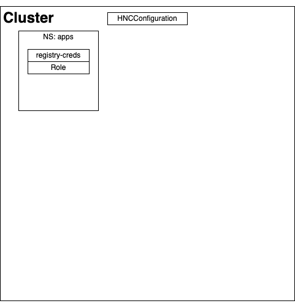
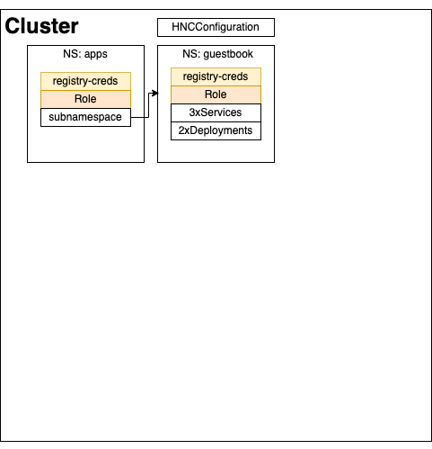
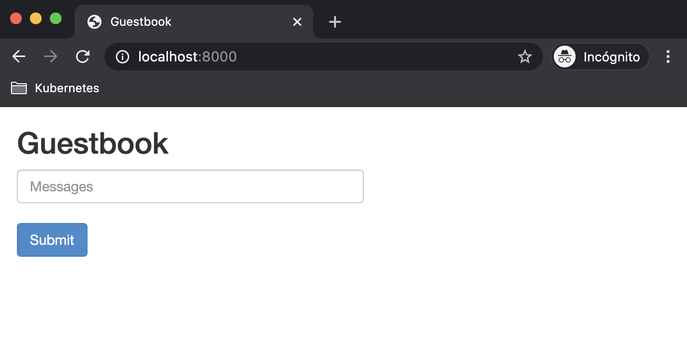
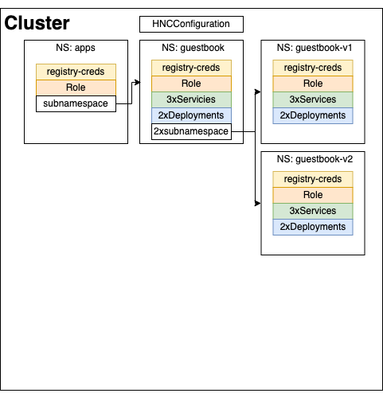
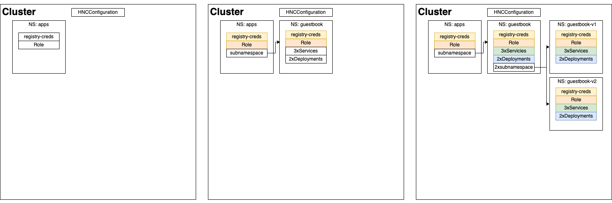

# HNC Use case - Application template

## Scenario

You are a cluster administrator; application team leader wants to scaffold a project template to allow their
developers to clone the app base to implement new features in a reproducible and stable environment.
Meanwhile, the team leader can modify the base app to modify platform services like the Redis database connection;
these changes have to be propagated to all development namespaces.


## Solution

Using HNC, you, as a cluster administrator, can design a namespace tree like the following:

```bash
$ kubectl hns tree apps
apps
└── guestbook
    ├── guestbook-v1
    └── guestbook-v2
NAME                 STATUS   AGE
apps                 Active   26m
default              Active   31m
guestbook            Active   24m
guestbook-v1         Active   24m
guestbook-v2         Active   24m
hnc-system           Active   29m
kube-node-lease      Active   31m
kube-public          Active   31m
kube-system          Active   31m
local-path-storage   Active   31m
```

### TL;DR

Deploy all, deploy [v1](guestbook-v1.yaml) and [v2 manifests](guestbook-v2.yaml)
in `guestbook-{v1,v2}` namespaces, test the app.

```bash
$ kubectl apply -f use-cases/application-template/manifests.yaml
# It can fail until child namespaces are created. Retry until receiving no error.
$ kubectl apply -f use-cases/application-template/guestbook-v1.yaml
deployment.apps/frontend created
$ kubectl get deploy -n guestbook-v1 frontend -o json | jq -r .spec.template.spec.containers[].image
gcr.io/rmlite-playground/guestbook-redis:v1.0.0
$ kubectl apply -f use-cases/application-template/guestbook-v2.yaml
deployment.apps/frontend created
$ kubectl get deploy -n guestbook-v2 frontend -o json | jq -r .spec.template.spec.containers[].image
gcr.io/rmlite-playground/guestbook-redis:v2.0.0
# Test the app v1
$ kubectl port-forward deploy/frontend 8000:80 -n guestbook-v1
Forwarding from 127.0.0.1:8000 -> 80
Forwarding from [::1]:8000 -> 80
# Test the app v2
$ kubectl port-forward deploy/frontend 8000:80 -n guestbook-v2
Forwarding from 127.0.0.1:8000 -> 80
Forwarding from [::1]:8000 -> 80
```

## Walkthrough

### Actors

We are going to execute commands using two different profiles:

- Cluster Admin (which is the default profile)
- Ángel from the APP team. He will create the application base and some subnamespace to host separate versions.

### Cluster configuration

**Actor: Cluster Administrator**

Currently, HNC does not support to have propagation configuration per {root}namespace. Instead, it stands configured via
a cluster-wide `HNCConfiguration` resource named `config`. By default, it is placed to propagate
`Role` and `RoleBindings` objects.

You have to add missing object types to the `HNCConfiguration` `config` object.

```bash
$ cat <<K8S | kubectl apply -f -
---
apiVersion: hnc.x-k8s.io/v1alpha1
kind: HNCConfiguration
metadata:
  name: config
spec:
  types:
  - apiVersion: rbac.authorization.k8s.io/v1
    kind: Role
    mode: propagate
  - apiVersion: rbac.authorization.k8s.io/v1
    kind: RoleBinding
    mode: propagate
  # Missing object types
  - apiVersion: apps/v1
    kind: Deployment
    mode: propagate
  - apiVersion: v1
    kind: Service
    mode: propagate
  - apiVersion: v1
    kind: Secret
    mode: propagate
K8S
Warning: kubectl apply should be used on resource created by either kubectl create --save-config or kubectl apply
hncconfiguration.hnc.x-k8s.io/config configured
```

Create the root namespace of the tree structure:

```bash
$ kubectl create namespace apps
namespace/apps created
```

Create in this namespace global objects that will be propagated across all child application namespaces:

- `my-registry-creds` `Secret`: Provides access to a private internal registry. Will be accessible from all child
namespaces.
- `self-provision` `Role`: Let users create new namespaces (subnamespaces).

```bash
$ cat <<K8S | kubectl apply -f -
---
apiVersion: v1
kind: Secret
metadata:
  name: my-registry-creds
  namespace: apps
type: kubernetes.io/dockerconfigjson
data:
  .dockerconfigjson: eyJhdXRocyI6eyJteS1jb3JwLWRvY2tlci1yZWdpc3RyeS5pbnRlcm5hbCI6eyJ1c2VybmFtZSI6Im15LXVzZXIiLCJwYXNzd29yZCI6Im15LXBhc3MiLCJhdXRoIjoiYlhrdGRYTmxjanB0ZVMxd1lYTnoifX19
---
apiVersion: rbac.authorization.k8s.io/v1
kind: Role
metadata:
  name: self-provision
  namespace: apps
rules:
- apiGroups: ["hnc.x-k8s.io/v1alpha1"]
  resources: ["subnamespaceanchors"]
  verbs: ["*"]
K8S
secret/my-registry-creds created
role.rbac.authorization.k8s.io/self-provision created
```

***Current status:***




### Creating guestbook base namespace

**Actor: Cluster Administrator and Angel**

The next step involves the creation of the child namespace that will be the base for new guestbook developments.
In this namespace, we need to define common infrastructure components like the `Services` and the Redis database so that
new child namespaces will have propagated and ready to use.

As a cluster administrator, create the base guestbook app namespace:

```bash
$ kubectl hns create -n apps guestbook
Successfully created "guestbook" subnamespace anchor in "apps" namespace
```

Then, Ángel, create the Services and Deployments that will be available in all child namespaces. It includes:

- Frontend service
- Redis-master Service
- Redis-slave Service
- Redis-master deployment
- Redis-slave deployment

```bash
$ cat <<K8S | kubectl apply -f -
---
apiVersion: v1
kind: Service
metadata:
  labels:
    app: guestbook
    tier: frontend
  name: frontend
  namespace: guestbook
spec:
  ports:
  - port: 80
  selector:
    app: guestbook
    tier: frontend
---
apiVersion: v1
kind: Service
metadata:
  labels:
    app: redis
    role: master
    tier: backend
  name: redis-master
  namespace: guestbook
spec:
  ports:
  - port: 6379
    targetPort: 6379
  selector:
    app: redis
    role: master
    tier: backend
---
apiVersion: v1
kind: Service
metadata:
  labels:
    app: redis
    role: slave
    tier: backend
  name: redis-slave
  namespace: guestbook
spec:
  ports:
  - port: 6379
  selector:
    app: redis
    role: slave
    tier: backend
---
apiVersion: apps/v1
kind: Deployment
metadata:
  name: redis-master
  namespace: guestbook
spec:
  replicas: 1
  selector:
    matchLabels:
      app: redis
      role: master
      tier: backend
  template:
    metadata:
      labels:
        app: redis
        role: master
        tier: backend
    spec:
      containers:
      - image: k8s.gcr.io/redis:e2e
        name: master
        ports:
        - containerPort: 6379
---
apiVersion: apps/v1
kind: Deployment
metadata:
  name: redis-slave
  namespace: guestbook
spec:
  replicas: 2
  selector:
    matchLabels:
      app: redis
      role: slave
      tier: backend
  template:
    metadata:
      labels:
        app: redis
        role: slave
        tier: backend
    spec:
      containers:
      - env:
        - name: GET_HOSTS_FROM
          value: dns
        image: gcr.io/rmlite-playground/guestbook-redis-slave:v1.0.0
        name: slave
        ports:
        - containerPort: 6379
K8S
```

At this point, the namespace tree will look like:

```bash
$ kubectl hns tree apps
apps
└── guestbook
```

And the infrastructural components are available in the guestbook base namespace:

```bash
$ kubectl get deploy,pod,service -n guestbook
NAME                           READY   UP-TO-DATE   AVAILABLE   AGE
deployment.apps/redis-master   1/1     1            1           2m56sdeployment.apps/redis-slave    2/2     2            2           2m56s

NAME                               READY   STATUS    RESTARTS   AGE
pod/redis-master-c6457d4d4-rj7sh   1/1     Running   0          2m56s
pod/redis-slave-696cdd9bdc-lbdh9   1/1     Running   0          2m56s
pod/redis-slave-696cdd9bdc-qqww6   1/1     Running   0          2m56s

NAME                   TYPE        CLUSTER-IP       EXTERNAL-IP   PORT(S)    AGE
service/frontend       ClusterIP   10.100.130.133   <none>        80/TCP     5m18s
service/redis-master   ClusterIP   10.102.196.231   <none>        6379/TCP   5m18s
service/redis-slave    ClusterIP   10.97.138.156    <none>        6379/TCP   5m18s
```

All of these components propagate to child namespaces.

***Current status:***




### Creating guestbook-v1 namespace

**Actor: Angel**

Now I can start developing my frontend application with a standard and stable application namespace template.
To start a new copy/instance of the guestbook:

```bash
$ kubectl hns create -n guestbook guestbook-v1
Successfully created "guestbook-v1" subnamespace anchor in "guestbook" namespace
$ kubectl hns tree apps
apps
└── guestbook
    └── guestbook-v1
```

Then you will find all objects from guestbook namespace has been copied/propagated so we can start developing our
frontend application.

Once you have a ready to test version of the fronted, deploy it and test it from your namespace:

```bash
$ kubectl apply -f use-cases/application-template/guestbook-v1.yaml
deployment.apps/frontend created
$ kubectl port-forward deploy/frontend 8000:80 -n guestbook-v1
Forwarding from 127.0.0.1:8000 -> 80
Forwarding from [::1]:8000 -> 80
```




***Current status:***




## Recap

This use case does not focus on how to grant permissions to different teams of developers. If you want to see an
example, take a look at the [self-provision use case](../self-provision). In a real environment, you have to take care
of granting permissions to different groups.

**An important note here**. This use case has a couple of drawbacks in the current status of HNC *(0.5.1)*:

- The controller can not propagate `Services` from a template namespace because it tries to replicate all fields of
the service object included the `spec.clusterIP`.
- Namespace template runs containers instead of keeping replicas at 0. It could be a problem if your common
infrastructural elements are super heavy.


