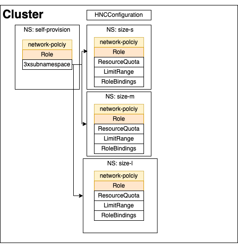
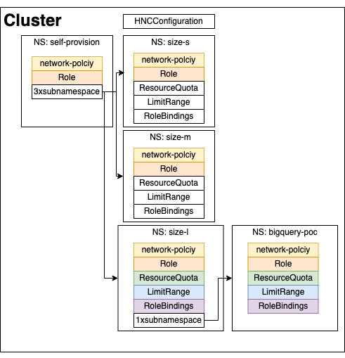
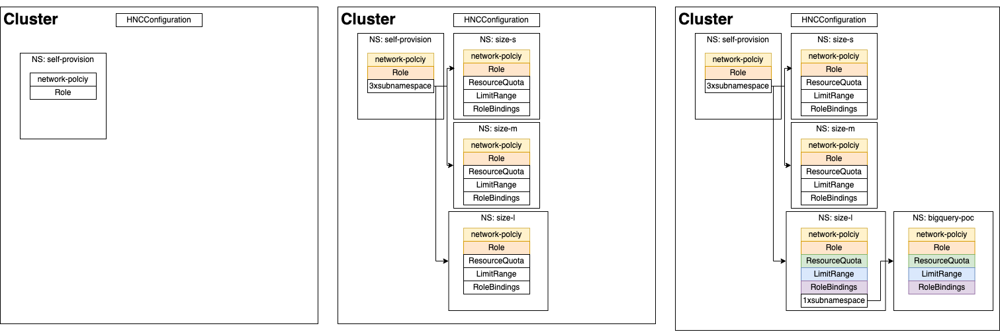

# HNC Use case - Self Provision

## Scenario

You are a cluster administrator; you know the importance of having `ResourceQuotas` and `LimitRange` objects configured
in every namespace. You have multiple developer teams with different requirements, and you have to provide them
a self-service experience to create namespaces with different sizes *(allocated resources)*. All namespaces have to be
isolated using `NetworkPolicy` objects.

## Solution

Using HNC, you, as a cluster administrator, can design a namespace tree like the following:

```bash
$ kubectl hns tree self-provision
self-provision
├── size-l
├── size-m
└── size-s
$ kubectl get ns
NAME                 STATUS   AGE
default              Active   45m
hnc-system           Active   44m
kube-node-lease      Active   45m
kube-public          Active   45m
kube-system          Active   45m
local-path-storage   Active   45m
self-provision       Active   3m3s
size-l               Active   56s
size-m               Active   57s
size-s               Active   60s
```

### TL;DR

Deploy all, try to create a namespace, fail, and create a sub-namespace, working, and configured.

```bash
$ kubectl apply -f use-cases/self-provision/manifests.yaml
# It can fail until child namespaces are created. Retry until receiving no error.
$ kubectl --as angel --as-group mlops create ns magic-mlk8s
Error from server (Forbidden): namespaces is forbidden: User "angel" cannot create resource "namespaces" in API group "" at the cluster scope
# You can not create namespaces directly
$ kubectl get ns magic-mlk8s
Error from server (NotFound): namespaces "magic-mlk8s" not found
# You can create namespaces using hns (subnamespaces, already configured)
$ kubectl hns --as angel --as-group mlops create -n size-l magic-mlk8s
Successfully created "magic-mlk8s" subnamespace anchor in "size-l" namespace
# It is a regular namespace
$ kubectl get ns magic-mlk8s
NAME          STATUS   AGE
magic-mlk8s   Active   2m51s
# But its pre-configured with the resources at size-l parent namespace
$ kubectl --as angel --as-group mlops get resourcequota -n magic-mlk8s
NAME      AGE     REQUEST                                     LIMIT
default   4m32s   requests.cpu: 0/8, requests.memory: 0/16G   limits.cpu: 0/8, limits.memory: 0/16G
```

## Walkthrough

### Actors

We are going to execute commands using two different profiles:

- Cluster Admin (which is the default profile)
- Ángel from the MLOps team. He will have access to `size-l` namespaces only.

### Cluster configuration

**Actor: Cluster Administrator**

Currently, HNC does not support to have propagation configuration per {root}namespace. Instead, it stands configured via
a cluster-wide `HNCConfiguration` resource named `config`. By default, it is placed to propagate
`Role` and `RoleBindings` objects.

You have to add missing object types to the `HNCConfiguration` `config` object.

```bash
$ cat <<K8S | kubectl apply -f -
---
apiVersion: hnc.x-k8s.io/v1alpha1
kind: HNCConfiguration
metadata:
  name: config
spec:
  types:
  - apiVersion: rbac.authorization.k8s.io/v1
    kind: Role
    mode: propagate
  - apiVersion: rbac.authorization.k8s.io/v1
    kind: RoleBinding
    mode: propagate
  # Missing object types
  - apiVersion: v1
    kind: LimitRange
    mode: propagate
  - apiVersion: v1
    kind: ResourceQuota
    mode: propagate
  - apiVersion: networking.k8s.io/v1
    kind: NetworkPolicy
    mode: propagate
K8S
Warning: kubectl apply should be used on resource created by either kubectl create --save-config or kubectl apply
hncconfiguration.hnc.x-k8s.io/config configured
```

Create the root namespace of the tree structure:

```bash
$ kubectl create namespace self-provision
```

Create in this namespace global objects that will be propagated across all child namespaces:

- `self-provision` `Role`: Let users create new namespaces (subnamespaces).
- `deny-from-other-namespaces` `NetworkPolicy`: Provides network isolation.

```bash
$ cat <<K8S | kubectl apply -f -
---
apiVersion: rbac.authorization.k8s.io/v1
kind: Role
metadata:
  namespace: self-provision
  name: self-provision
rules:
- apiGroups: ["hnc.x-k8s.io/v1alpha1"]
  resources: ["subnamespaceanchors"]
  verbs: ["*"]
---
kind: NetworkPolicy
apiVersion: networking.k8s.io/v1
metadata:
  namespace: self-provision
  name: deny-from-other-namespaces
spec:
  podSelector:
    matchLabels:
  ingress:
  - from:
    - podSelector: {}
K8S
role.rbac.authorization.k8s.io/self-provision created
networkpolicy.networking.k8s.io/deny-from-other-namespaces created
```

***Current status:***


#### Creating self-provision subnamespaces

**Actor: Cluster Administrator**

The next step involves the creation of namespaces *(subnamespaces)* under the `self-provision` namespace.
This way, subnamespaces will inherit the `Role` and the `NetworkPolicy` defined in the `self-provision` namespace.

As a cluster administrator, you design namespaces templates with T-shirt sized quotas:

- `size-s`: Low resource workloads perfectly fits for frontend development.
- `size-m`: Regular resources workloads, for traditional backend developments.
- `size-l`: High resource workloads, for those AI and ML workloads.

```bash
$ kubectl hns create -n self-provision size-s
Successfully created "size-s" subnamespace anchor in "self-provision" namespace
$ kubectl hns create -n self-provision size-m
Successfully created "size-m" subnamespace anchor in "self-provision" namespace
$ kubectl hns create -n self-provision size-l
Successfully created "size-l" subnamespace anchor in "self-provision" namespace
```

These three commands create a subnamespace inside `self-provision` namespace. The controller will create child
namespaces:

```bash
$ kubectl hns tree self-provision
self-provision
├── size-l
├── size-m
└── size-s
$ kubectl get ns
NAME                 STATUS   AGE
default              Active   109m
hnc-system           Active   108m
kube-node-lease      Active   109m
kube-public          Active   109m
kube-system          Active   109m
local-path-storage   Active   109m
self-provision       Active   11m
size-l               Active   67s
size-m               Active   68s
size-s               Active   70s
```

Check all objects has been propagated:

```bash
$ kubectl get networkpolicies -A
NAMESPACE        NAME                         POD-SELECTOR   AGE
self-provision   deny-from-other-namespaces   <none>         11m
size-l           deny-from-other-namespaces   <none>         103s
size-m           deny-from-other-namespaces   <none>         105s
size-s           deny-from-other-namespaces   <none>         107s
$ kubectl get role -A | grep self
self-provision   self-provision                                   2020-08-20T13:30:54Z
size-l           self-provision                                   2020-08-20T13:43:46Z
size-m           self-provision                                   2020-08-20T13:43:47Z
size-s           self-provision                                   2020-08-20T13:43:46Z
```

##### Configuring self-provision subnamespace: size-l

**Actor: Cluster Administrator**

Configure `size-l` subnamespace *(replicate the following commands in the `size-s` and `size-m` subnamespaces)*.

To ensure `size-l` namespace template *(subnamespace)* use only a specific amount of resources, create:

- **ResourceQuota**: provides constraints that limit aggregate resource consumption per namespace.
- **LimitRange**: policy to constrain resource allocations (to Pods or Containers) in a namespace.

```bash
$ cat <<K8S | kubectl apply -f -
---
apiVersion: v1
kind: ResourceQuota
metadata:
  name: default
  namespace: size-l
spec:
  hard:
    requests.cpu: 8
    requests.memory: 16G
    limits.cpu: 8
    limits.memory: 16G
---
apiVersion: v1
kind: LimitRange
metadata:
  name: default
  namespace: size-l
spec:
  limits:
  - default:
      cpu: 1
      memory: 512M
    defaultRequest:
      cpu: 1
      memory: 512M
    type: Container
K8S
resourcequota/default created
limitrange/default created
```

Finally, grant access via `RoleBinding` to the *mlops team*. Create:

- `default` `RoleBinding`: Grant enough permissions to deploy workloads there. **NOTE**: Craft your own role instead
of using `cluster-admin`. Take this as an example.
- `default-self-provision`: Grant permissions to create subnamespaces. With this `RoleBinding` users will be able to
self-provision namespaces with this configuration.

```bash
$ cat <<K8S | kubectl apply -f -
---
apiVersion: rbac.authorization.k8s.io/v1
kind: RoleBinding
metadata:
  name: default
  namespace: size-l
roleRef:
  apiGroup: rbac.authorization.k8s.io
  kind: ClusterRole
  name: cluster-admin
subjects:
- kind: Group
  name: mlops
  apiGroup: rbac.authorization.k8s.io
---
apiVersion: rbac.authorization.k8s.io/v1
kind: RoleBinding
metadata:
  name: default-self-provision
  namespace: size-l
roleRef:
  apiGroup: rbac.authorization.k8s.io
  kind: Role
  name: self-provision
subjects:
- kind: Group
  name: mlops
  apiGroup: rbac.authorization.k8s.io
K8S
rolebinding.rbac.authorization.k8s.io/default created
rolebinding.rbac.authorization.k8s.io/default-self-provision created
```

Review what objects are present in the `size-l` namespace:

```
$ kubectl get rolebinding,role,networkpolicies,resourcequota,limitrange -n size-l
NAME                                                           ROLE                        AGE
rolebinding.rbac.authorization.k8s.io/default                  ClusterRole/cluster-admin   7m2s
rolebinding.rbac.authorization.k8s.io/default-self-provision   Role/self-provision         7m2s

NAME                                            CREATED AT
role.rbac.authorization.k8s.io/self-provision   2020-08-20T13:43:46Z

NAME                                                         POD-SELECTOR   AGE
networkpolicy.networking.k8s.io/deny-from-other-namespaces   <none>         22m

NAME                    AGE    REQUEST                                     LIMIT
resourcequota/default   9m9s   requests.cpu: 0/8, requests.memory: 0/16G   limits.cpu: 0/8, limits.memory: 0/16G

NAME                 CREATED AT
limitrange/default   2020-08-20T13:54:13Z
```

***Current status:***




All of these objects will be propagated to child namespaces to self-provision their own configured `size-l` namespaces.

### size-l namespace instance

**Actor: Ángel @ MLOps team**

As a developer in the MLOps team, I need to deploy a big POC. If I try to create a namespace to implement my solution:

```bash
$ kubectl --as Angel --as-group mlops create namespace bigquery-poc
Error from server (Forbidden): namespaces is forbidden: User "Angel" cannot create resource "namespaces" in API group "" at the cluster scope
```

The error :top: was expected as I don't have cluster level permissions. If I try to create a `size-m` namespace:

```bash
$ kubectl hns create --as Angel --as-group mlops bigquery-poc -n size-m

Could not create subnamespace anchor.
Reason: subnamespaceanchors.hnc.x-k8s.io "bigquery-poc" is forbidden: User "Angel" cannot create resource "subnamespaceanchors" in API group "hnc.x-k8s.io" in the namespace "size-m"
```

The error :top: was expected. mlops group/team owns permission to create subnamespaces in the `size-l` namespace:

```bash
$ kubectl hns create --as Angel --as-group mlops bigquery-poc -n size-l
Successfully created "bigquery-poc" subnamespace anchor in "size-l" namespace
```

Check all objects was correctly propagatted:

```bash
$ kubectl --as Angel --as-group mlops get rolebinding,role,networkpolicies,resourcequota,limitrange -n bigquery-poc
NAME                                                           ROLE                        AGE
rolebinding.rbac.authorization.k8s.io/default                  ClusterRole/cluster-admin   79s
rolebinding.rbac.authorization.k8s.io/default-self-provision   Role/self-provision         79s

NAME                                            CREATED AT
role.rbac.authorization.k8s.io/self-provision   2020-08-20T14:13:47Z

NAME                                                         POD-SELECTOR   AGE
networkpolicy.networking.k8s.io/deny-from-other-namespaces   <none>         78s

NAME                    AGE   REQUEST                                     LIMIT
resourcequota/default   78s   requests.cpu: 0/8, requests.memory: 0/16G   limits.cpu: 0/8, limits.memory: 0/16G

NAME                 CREATED AT
limitrange/default   2020-08-20T14:13:47Z
```

***Current status:***



Now I'm ready to use the recently created namespace:

```bash
$ kubectl --as Angel --as-group mlops run nginx --image=nginx -n bigquery-poc
pod/nginx created
$ kubectl --as Angel --as-group mlops get pods -n bigquery-poc
NAME    READY   STATUS    RESTARTS   AGE
nginx   1/1     Running   0          38s
```

## Recap

Designing a good tree structure could be a good idea to enable self-provisioning namespaces to different teams.
As a cluster administrator, you have to take care of what roles and role bindings you need to create because it will
eventually be propagated to child namespaces.

The tree can have as many child levels as needed, but it could be challenging to manage.


